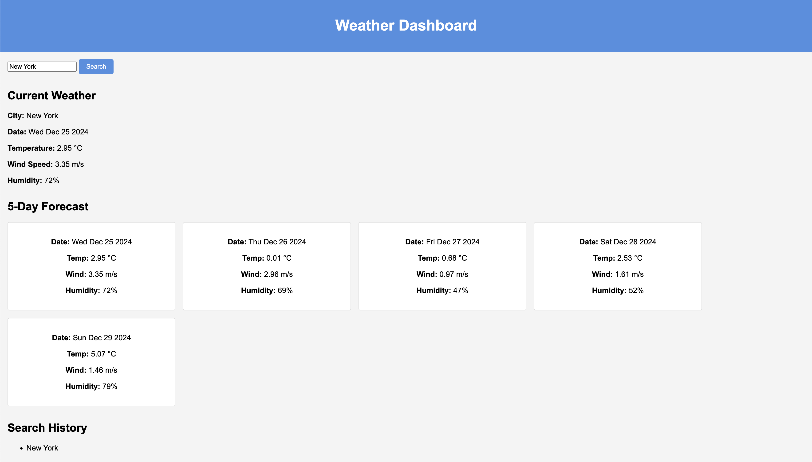

# Weather Dashboard

## Description

The **Weather Dashboard** is a web application that allows users to search for current and future weather conditions for multiple cities. The app uses the OpenWeatherMap API to provide accurate and detailed weather data, including temperature, wind speed, and humidity. It features a sleek, responsive design, dynamically updated HTML and CSS, and persistent search history saved with localStorage.

This project demonstrates how to fetch and display data from a third-party API, manage user interactions, and store persistent data in the browser.

---

## Features

- **City Search**: Search for any city to view its current weather and a 5-day forecast.
- **Dynamic Weather Data**: Displays city name, date, temperature, wind speed, humidity, and weather icons.
- **Search History**: Saves previously searched cities in localStorage and displays them for quick access.
- **Clean User Interface**: A modern, responsive design that works seamlessly across devices.
- **API Integration**: Utilizes OpenWeatherMap's Geocoding API and 5-Day Weather Forecast API.

---

## Table of Contents

- [Installation](#installation)
- [Usage](#usage)
- [Technologies Used](#technologies-used)
- [Screenshot](#screenshot)
- [Live Demo](#live-demo)
- [License](#license)

---

## Installation

1. Clone the repository to your local machine:

   ```bash
   git clone https://github.com/your-username/weather-dashboard.git

   ```

2. Navigate to the project directory:

   ```bash
   cd weather-dashboard

   ```

3. Open the project in your preferred code editor (e.g., VS Code).

4. Open `index.html` in a browser to view the app.

---

## Usage

1. Enter a city name in the search input field and click the "Search" button.
2. View the current weather conditions and the 5-day forecast for the searched city.
3. Click on any city in the search history to re-fetch its weather data.
4. Search history is saved even after refreshing or closing the browser.

---

## Technologies Used

- **HTML5**: For the structure of the application.
- **CSS3**: For styling and responsive design.
- **JavaScript (ES6+)**: For interactivity and API integration.
- **OpenWeatherMap API**: For retrieving weather and location data.
- **LocalStorage**: For persisting search history.

---

## Screenshot



---

## Live Demo

Check out the live application here: [Weather Dashboard](https://michaelpratt23.github.io/06-Weather-Dashboard/)

---

## License

This project is licensed under the MIT License. See the [LICENSE](LICENSE) file for details.

---

## Acknowledgments

- Thanks to [OpenWeatherMap](https://openweathermap.org/) for providing the weather data APIs.
- Inspired by the challenge provided in the coding bootcamp.
